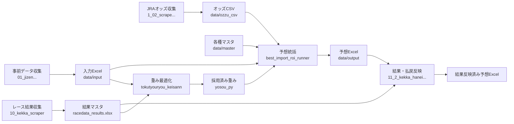
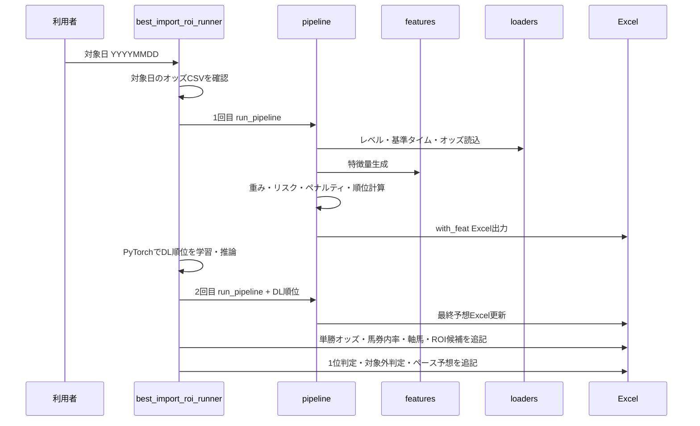
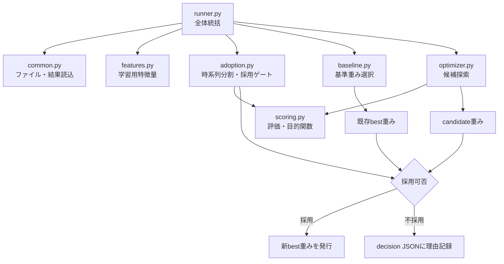

# 競馬予想システム コードマップ

作成日: 2026-08-06  
対象: このフォルダ以下のプロジェクト固有 Python コード 26ファイル（`.venv` 内の外部ライブラリは除外）

## 1. システム全体像

このシステムは、レース前データを収集し、特徴量と予想順位を作成し、レース後に結果を反映する通常予想系と、過去データから特徴量重みを探索・採用する最適化系で構成される。



### コード領域

| 領域 | 役割 | 主な入口 |
|---|---|---|
| 通常予想 | 特徴量作成、スコア・順位、馬券内率、買い目、ペース予想 | `1_keibayosou_best_import_roi_runner.py` |
| 重み最適化 | 時系列分割、重み探索、検証・テスト採用ゲート、best重み発行 | `python -m tokutyouryou_keisann` |
| データ準備・結果反映 | 事前情報、オッズ、結果の収集、マスタ更新、払戻反映 | `etc_py/*.py` |
| 重みデータ | 通常予想が読み込む採用済み特徴量重み | `yosou_py/best_feature_weights_20260730.py` |

## 2. 通常予想の処理フロー



### スコア計算の概念

`1_keibayosou_pipeline.py` が、レース内正規化済み特徴量に重みを適用し、人気リスクと追加ペナルティを差し引いて順位を作る。`KEIBA_SCORING_MODEL_VERSION` により現行重みモデル（`legacy` という互換名）と比較用 `five_block` を切り替えられる。DL混合係数の既定値は 0 で、DL順位は2回目のパイプラインへ渡されるが、設定値によってスコアへの影響が決まる。

## 3. 通常予想コード

### `1_keibayosou_best_import_roi_runner.py` — 通常予想の実行入口

- 役割: 予想パイプラインを2回実行し、DL順位、推定馬券内率、オッズ、買い目、危険馬、ペース予想まで最終Excelへまとめる。
- 入力: 対象日の `data/input/馬の競走成績_YYYYMMDD.xlsx`、オッズCSV、各マスタ、過去の `with_feat` 出力。
- 出力: `data/output/馬の競走成績_with_feat_YYYYMMDD.xlsx`。
- 直接依存: `config`、`loaders`、`pipeline`、`pace`、`utils`。数字始まりの実ファイルを `_register_renamed_keibayosou_modules()` で互換モジュール名へ登録する。
- 主要処理:
  - `main()`: 日付入力、オッズ存在確認、2段階予想、全後処理の統括。
  - `_resolve_raw_src_out_paths()` / `_pick_actual_out_excel()`: 対象日の入出力パス解決。
  - `_create_dl_rank_df()`、`SimpleMLP`、`_train_model()`、`_predict_dl_rank()`: 過去結果を教師データにした小規模MLPの学習と順位推論。
  - `_canonical_prediction_frame()`～`add_estimated_in3_rate()`: 過去予想と実績から順位帯・スコア帯別の複勝圏率を算出し、オッズや条件で補正。
  - `_add_estimated_in3_rate_to_excel()`: `推定馬券内率`、`妙味あり馬`、`危険馬`、率テーブルを追加。
  - `_fill_tansho_odds_to_bet_sheet()` / `_fill_axis_umaban_to_bet_sheet()`: 買い目シートへ単勝オッズと軸馬番を反映。
  - `_write_rank1_judgment_to_bet_sheet()`: 予想1位の採否・対象外理由を判定しREADMEへ条件も記録。

### `1_keibayosou_config.py` — 通常予想の中央設定

- 役割: パス、シート名、特徴量、重み、スコアモデル、ペナルティ閾値を一元管理する。
- 主な設定: `FEAT_COLS`、`FEATURE_WEIGHTS`、`FEATURE_WEIGHTS_BY_PLACE_SURFACE`、`SCORING_FEATURE_BLOCKS`、`SCORING_BLOCK_WEIGHTS`、`ALPHA`、`EXTRA_ALPHA`。
- 外部重み: `_find_latest_weights_module()` が `yosou_py/best_feature_weights_YYYYMMDD.py` の最新日付を選び、組み込み重みへマージする。
- 安全策: 無効化特徴量を常に0へ戻し、`_enforce_empirical_weight_signs()` で経験的な符号制約を適用する。
- パス: コード配下の `data/input`、`data/master`、`data/ozzu_csv` を使用。一部の共有パスだけ `DATA_ROOT` の外部ルートを保持する。
- 診断: `print_scoring_model_status()` と `print_active_feature_weights()` が実効モデル・重みを表示する。

### `1_keibayosou_loaders.py` — マスタ・オッズ読込

- 役割: 外部ファイルを、予想ロジックが結合できる正規化済みDataFrameへ変換する。
- `load_race_levels()`: `race_levels.xlsx` の ratings / horses / entries 等を読み、履歴レーティングマスタを構築する。
- `load_base_time()`: 競馬場・芝ダ・距離・馬場別の基準タイムを読む。
- `load_odds_csv()`: 単勝・複勝・3連複など表記揺れのあるオッズCSVを標準列へ変換する。
- `_convert_ozzu_to_odds()`: JRAスクレイパー形式を予想用キーへ変換する。
- `_raise_on_duplicate_keys()`: レース・馬番等の重複キーを検知し、誤結合を防ぐ。
- CSV文字コードや欠損ファイルにはフォールバック処理を持つ。

### `1_keibayosou_features.py` — 特徴量生成エンジン

- 役割: 今走情報と各馬の過去走シートから、馬の能力・適性・安定性・脚質等を数値化する。
- `build_features_from_excel()`: Excel読込から特徴量DataFrame返却までの公開入口。
- `_compute_horse_features_from_race_sheets()`: 馬ごとに過去走を選び、近走・条件一致・レーティング・脚質特徴量を作る中核処理。
- `_attach_master_rating_features()`: race levelマスタ由来の能力値を付与。
- `_calc_contextual_last3f_features()`: 同距離帯・同競馬場等の条件別上がり3Fを計算。
- `_build_running_style_profile()` / `_calc_front_pressure()` / `_calc_style_pressure_fit()`: 脚質構成、先行圧、想定ペースへの適合度を作る。
- `calc_course_style_features()` 呼出し: コース別脚質適性を付与。
- `apply_weights()` / `score_sum()` / `normalize_score()`: 重み適用と基本スコア処理。
- `build_calc_favorite_risk()`: 人気と実績の不一致によるリスク指標を作る。
- 障害レースと、登録頭数に対して履歴が不足するレースを予想対象から除外する処理を含む。

### `1_keibayosou_course_style.py` — コース・脚質適性

- 役割: 競馬場、芝ダ、距離、馬場、ペースと馬の脚質からコース適性特徴量を算出する。
- `CourseStyleRule`: コース条件と逃げ・先行・差し・追込の基礎点を保持するルール。
- 正規化群: `normalize_place()`、`normalize_surface()`、`parse_distance()`、`normalize_track_condition()`、`normalize_pace()`。
- 脚質推定: `infer_running_style_from_pass()`、`dominant_running_style_from_pass_series()`。
- `calc_course_style_features()`: 基礎ルールへ馬場・ペース・小回り先行・長い直線差し等の補正を加え、最終適性値を返す。

### `1_keibayosou_penalties.py` — リスク・減点計算

- 役割: 良く見えるが不安要素を持つ馬の条件付き減点を、パイプラインから分離して計算する。
- `calc_rest_dist_risk()`: 長期休養と距離変更の複合リスクを0～1で算出。
- `calc_extra_penalty_components()`: 人気常連、善戦止まり、惜敗続き、出走数等のペナルティ内訳を返す。
- `calc_extra_penalty()`: 内訳を合算して最終ペナルティを返す。
- 閾値と係数は `1_keibayosou_config.py` から取得する。

### `1_keibayosou_pipeline.py` — スコア・順位・Excel出力

- 役割: 読込、特徴量、スコアリング、除外判定、出力を結ぶ通常予想の本体。
- `run_pipeline()`: マスタ読込 → 特徴量作成 → 履歴不足除外 → DL列結合 → リスク計算 → スコア・順位 → Excel出力。
- `compute_scores_with_pipeline_logic()`: 現行またはfive-blockの計算式を選び、`score_raw`、ペナルティ、最終score、rankを生成。
- `compute_five_block_scores()`: 能力・適性などのブロック別集約スコアを計算する比較用モデル。
- `_exclude_races_with_missing_history()`: 登録頭数分の履歴特徴量が揃わないレースを除外。
- `_build_bet_sheet()` / `build_roi_focus_bet_sheet()`: レース別買い目と回収率重視候補を組み立てる。
- `write_features_to_excel()`: `TARGET`、今走、特徴量健康診断、相関、寄与、買い目等のシートを書き出す。
- `append_success_report()`: 実行結果を累積レポートへ追記する。

### `1_keibayosou_pace.py` — ペース予想

- 役割: 過去走の通過順、ラップ、コース類似度、距離類似度からレースの流れを予測する。
- `HorsePaceProfile`: 各馬の脚質・前半速度・過去サンプルを保持するデータ構造。
- `calculate_horse_pace_profile()`: 最大5走から馬単位のペース特性を算出。
- `calculate_race_pace_prediction()`: 逃げ・先行候補と前半速度を集約し、超スロー～超ハイの5区分を決定。
- `build_pace_prediction_dataframe()`: レースごとの予想結果と根拠を表形式にする。
- `append_pace_prediction_sheet_to_excel()`: 一時ファイルへ安全に保存し、元シート不変・行数・候補整合性を検証してから置換する。

### `1_keibayosou_utils.py` — 共通ユーティリティ

- 役割: 型変換、名称正規化、レース内正規化、特徴量診断、Excel用列整形を提供する。
- `_retry_session()`: リトライ設定済みHTTPセッション。
- `_to_int()` / `_to_float()` / `_safe_div()`: 欠損や異常値に強い数値処理。
- `_normalize_place()` / `_normalize_surface()`: 競馬場・芝ダ表記の統一。
- `normalize_features_within_race()`: 特徴量をレース単位で比較可能な尺度へ正規化。
- `build_feature_health_diagnostics()`: 欠損率、分散、利用可否などを診断。
- `_build_feature_sheet_for_export()`: 内部列を日本語表示列へ変換。
- `_ensure_rid_str()`: レースID文字列を保証する。

## 4. 特徴量重み最適化パッケージ



### `tokutyouryou_keisann/__init__.py` — パッケージ公開口

- `runner.main` を `main` として公開する。

### `tokutyouryou_keisann/__main__.py` — `python -m` 入口

- `python -m tokutyouryou_keisann` 実行時に `runner.main()` を呼ぶ。

### `tokutyouryou_keisann/tokutyouryou_keisann20260313_placewise.py` — 互換実行入口

- パッケージ親を `sys.path` に追加し、`tokutyouryou_keisann.runner.main()` へ処理を委譲する旧来互換の薄いラッパー。

### `tokutyouryou_keisann/config.py` — 最適化設定

- 役割: プロジェクトルート、入力・出力先、期間、探索回数、特徴量、初期重み、採用閾値を定義する。
- `KEIBA_ROOT` 環境変数を優先し、未指定時はフォルダ構成からプロジェクトルートを検出する。
- 通常予想側 `1_keibayosou_config.py` を動的に読み、`FEAT_COLS` と重み定義の同期を優先する。
- `OPTIMIZER_FIXED_ZERO_FEATURES` は診断専用・本番無効特徴量を探索対象から外す。
- `CONFIG` はTRAIN / VALID / TEST期間、最適化条件、結果ファイル等をまとめた設定辞書。

### `tokutyouryou_keisann/common.py` — 最適化共通処理

- `discover_files()`: 学習対象の `data/input` Excelを探索。
- `load_results_all_sheets()`: 結果マスタの複数シートを結合し、着順・払戻を正規化。
- `build_rid_to_date_map()` / `parse_rid_meta()`: レースIDから日付・場所・芝ダ等のメタ情報を構築。
- `_get_weights_for_place_surface()`: 全国、競馬場別、競馬場×芝ダ別の順で実効重みを選択。
- `_blend_weights()` / `_clip_weight_by_name()`: 重み混合と範囲・符号制約。
- `RaceMeta`: レース単位のメタ情報を保持する。

### `tokutyouryou_keisann/features.py` — 最適化用特徴量作成

- `build_features_from_one_file()`: 通常予想の `build_features_from_excel()` を呼び、1入力Excelから学習用行を構築する。
- `_load_pipeline_master_data()`: race level、基準タイム、オッズをキャッシュ読込。
- `_ensure_optimizer_required_columns()`: 評価に必要なキー・結果列・補助列を保証。
- `_build_pipeline_context_maps()`: 通常予想と同じ `favorite_risk` 計算に必要な履歴マップを作成。
- `_attach_dl_features()`: 過去の予想出力からDL列を補完。
- 目的: 本番パイプラインと最適化時の特徴量・補正条件のずれを抑える。

### `tokutyouryou_keisann/scoring.py` — 高速評価・目的関数

- `build_eval_context()`: 数値配列とグループ情報を事前計算し、反復評価を高速化。
- `compute_scores_with_optimizer_weights()`: 候補重みから本番互換のscore・rankを計算。
- `eval_success_and_roi()`: top5内の的中等、採用判断用の評価指標を算出。
- `summarize_stability()`: 期間・条件間の安定性を要約。
- `calc_objective_score()` / `better_by_objective()`: 複数指標を目的値に集約し、候補の優劣を比較。
- ペナルティは通常予想側の関数を優先し、利用不能時のベクトル化フォールバック式も持つ。

### `tokutyouryou_keisann/optimizer.py` — 重み探索

- `random_neighbor()`: 現在の重みから制約内の近傍候補を生成。
- `optimize_single_weight_set()`: 複数seedでランダム近傍探索を行い、目的関数が改善する候補を保持。
- `optimize_placewise_weights()`: 全国重みを起点に競馬場別、競馬場×芝ダ別の重みを段階的に最適化。
- 固定0、重み範囲、符号ガード、基準重みとのブレンドを適用する。

### `tokutyouryou_keisann/adoption.py` — 時系列分割・採用判定

- `PeriodSplit`: TRAIN / VALID / TESTのDataFrameと集計を保持。
- `split_train_valid_test()`: 日付境界でデータを分け、レースID重複や期間混入を検査。
- `evaluate_valid_gate()`: VALIDでcandidateがbaselineを上回るか、最低件数や安定性も含めて判定。
- `evaluate_test_gate()`: VALID通過後だけTESTを評価し、最終採用可否を判定。
- `evaluate_weight_adoption()`: 旧来互換の一括評価入口。

### `tokutyouryou_keisann/baseline.py` — 基準重みの選択・同一性検証

- `select_baseline_weight_file()`: 採用履歴JSONを優先し、なければ本番最新bestを基準に選ぶ。
- `load_effective_weights_file()` / `load_baseline_weights()`: Python重みモジュールを厳格に読み、本番と同じマージ後の実効重みを返す。
- `compare_weights_maps()` / `normalized_weights_sha256()`: candidate保存前後や本番読込後の重み同一性を検証。
- `sha256_file()`: ファイル改変検知用ハッシュ。
- `BaselineWeightError`: 基準重みを安全に確定できない場合の専用例外。

### `tokutyouryou_keisann/runner.py` — 最適化の実行統括

- `main()`: ファイル探索、特徴量生成、結果結合、時系列分割、baseline評価、最適化、採用判定、成果物発行を統括。
- `_split_train_test_with_file_exclusion()`: 対象外ファイルを除き、期間別データを構築。
- `_filter_clean_eval_df()`: 不完全・不整合レースを評価集合から除外。
- `_prepare_candidate_roundtrip()`: candidateを一度Pythonモジュールとして保存・再読込し、本番時の実効重みと一致するか検証。
- `_evaluate_adoption_flow()`: VALID通過時のみTESTへ進む二段階ゲート。
- `_publish_candidate_and_best()`: candidateを保存し、採用時だけ日付付きbestへ昇格。
- 出力: candidate/best重み `.py`、`data/output/weight_adoption/decision_*.json`、詳細評価Excel。
- CLI: `--baseline-weight-file`、`--verify-baseline-only`（`--dry-run`）、`--trial-iterations`、`--trial-max-files-per-period`、`--validate-train-data-only`。

## 5. データ収集・変換・結果反映コード

### `etc_py/01_jizen_syuusyuu_race_info_classfix_20251212.py` — レース前情報収集

- netkeibaへSeleniumでログインし、そのCookieをrequestsセッションへ引き継ぐ。
- 日付のレースID、出馬表、馬名・馬URL、馬番、年齢、斤量、騎手、厩舎、レース条件を取得する。
- 各馬の過去競走成績とラップを取得し、`今走レース情報` と馬別シートを持つ入力Excelを `data/input` に出力する。
- `config/credentials.ini` を使用するが、認証情報そのものは本資料の対象外。

### `etc_py/1_02_scrape_jra_odds_2.py` — JRAオッズ収集

- PlaywrightでJRAの当日開催ページを辿る。
- `parse_tanpuku()`: 単勝・複勝オッズを解析。
- `parse_trio()`: 3連複の組合せとオッズを解析。
- `_validate_rows_before_save()`: 日付・開催場・レース・馬の重複や欠損を保存前検査。
- `scrape_odds()`: `data/ozzu_csv/OZZU_YYYYMMDD.csv` を出力する。
- `HEADLESS` と `DATE_STR` が実行設定。

### `etc_py/10_kekka_scraper_20260102.py` — レース結果収集

- Edge/Seleniumでnetkeibaへログインし、指定日の全レース結果を取得する。
- `get_race_ids_for_date()`: 日付ページの遅延読込・スクロール後にレースIDを抽出。
- `scrape_one_race()`: 着順、馬情報、タイム、通過、上がり、人気、払戻等を取得。
- `save_to_excel()`: `data/master/racedata_results.xlsx` に日付単位で保存する。
- `config/credentials.ini` を使用する。

### `etc_py/00_Export_To_Excel_4.py` — 結果マスタ・レーティング生成

- 役割: 収集済み結果Excelを走査し、レースレベルと馬のレーティング履歴を再計算する。
- `process_excel_to_memory()`: レースを時系列処理し、クラス、基準タイム差、着順、着差、人気、通過順等からパフォーマンス値を計算。
- `MemoryStore`: 馬ID、総合・芝ダ別rating、履歴、entries、条件別基準値をメモリ保持。
- `parse_race_class()` / `load_grade_race_master()`: レース名と重賞マスタからクラスを判定。
- `calc_time_master_score()` / `calc_final_race_level_score()`: 馬場・距離別基準タイムを使うレース品質評価。
- `compute_performance_score()` / `k_factor()`: 個体の走りを評価し、出走経験に応じてratingを更新。
- `write_store_to_excel()`: `data/master/race_levels.xlsx` を複数シート構成で出力する。

### `etc_py/11_2_kekka_hanei_payout_260322 copy.py` — 予想Excelへ結果反映

- 対象日の結果マスタと予想Excelを選び、元ファイルを直接上書きせず `_with_result.xlsx` を作る。
- `_load_results_maps()`: レースID×馬番／馬名から着順・払戻を引ける辞書を作る。
- `_update_buysheet_hit_and_payout()`: 買い目ごとの的中、払戻、収支を更新。
- `_update_danger_horse_sheet_result()`: 危険馬の実着順から判定結果を追記。
- `TARGET` の着順列と、単勝～3連単の払戻列を更新する。

## 6. 重みデータコード

### `yosou_py/best_feature_weights_20260730.py` — 採用済み重みスナップショット

- 実行ロジックを持たないPythonデータモジュール。
- 全国共通、競馬場別、競馬場×芝ダ別の特徴量重み辞書を保持する。
- `1_keibayosou_config.py` が日付付きファイル名の最新を自動選択して読み込む。
- 最適化runnerが採用ゲートを通過した候補を、新しい日付付きbestとして同じ形式で発行する。
- 手編集すると通常予想と採用履歴のハッシュ整合性が崩れる可能性があるため、原則として最適化フロー経由で更新する。

## 7. ファイル間依存関係

矢印は「左が右をimportまたは動的利用する」を表す。

```text
1_keibayosou_best_import_roi_runner.py
  -> 1_keibayosou_config.py
  -> 1_keibayosou_loaders.py -> 1_keibayosou_utils.py
  -> 1_keibayosou_pipeline.py
       -> 1_keibayosou_config.py
       -> 1_keibayosou_features.py
            -> 1_keibayosou_course_style.py
            -> 1_keibayosou_config.py
            -> 1_keibayosou_utils.py
       -> 1_keibayosou_loaders.py
       -> 1_keibayosou_penalties.py -> 1_keibayosou_config.py
       -> 1_keibayosou_utils.py
  -> 1_keibayosou_pace.py
  -> 1_keibayosou_utils.py

tokutyouryou_keisann.runner
  -> config, common, features, optimizer, scoring, adoption, baseline
tokutyouryou_keisann.features
  -> 通常予想の config / loaders / features / pipeline / penalties
tokutyouryou_keisann.optimizer -> scoring, common, config
tokutyouryou_keisann.scoring -> common, config, 通常予想penalties
tokutyouryou_keisann.adoption -> pandas（評価関数はrunnerから注入）
tokutyouryou_keisann.baseline -> common, config, yosou_pyの重みファイル
```

## 8. 主要データと所有コード

| データ | 主な作成元 | 主な利用先 |
|---|---|---|
| `data/input/馬の競走成績_*.xlsx` | 事前情報収集 | 通常予想、重み最適化 |
| `data/ozzu_csv/OZZU_*.csv` | JRAオッズ収集 | loaders、通常予想runner |
| `data/master/racedata_results.xlsx` | 結果収集 | DL学習、馬券内率推定、最適化、結果反映 |
| `data/master/race_levels.xlsx` | Export_To_Excel | features、loaders、最適化 |
| `data/master/場所_馬場_タイム.xlsx` | 管理マスタ | loaders、Export_To_Excel |
| `data/master/grade_race_master.csv` | 管理マスタ | Export_To_Excel |
| `data/output/馬の競走成績_with_feat_*.xlsx` | 通常予想runner | 過去率集計、DL補助、結果反映、最適化補助 |
| `data/output/weight_adoption/decision_*.json` | 最適化runner | baseline選択、採否監査 |
| `yosou_py/best_feature_weights_*.py` | 最適化runner | 通常予想config、次回最適化baseline |

## 9. 標準的な運用順序

1. `etc_py/01_jizen_syuusyuu_race_info_classfix_20251212.py` で対象日の入力Excelを作る。
2. `etc_py/1_02_scrape_jra_odds_2.py` で対象日のオッズCSVを作る。
3. `1_keibayosou_best_import_roi_runner.py` を実行して最終予想Excelを作る。
4. 開催後、`etc_py/10_kekka_scraper_20260102.py` で結果マスタを更新する。
5. `etc_py/11_2_kekka_hanei_payout_260322 copy.py` で予想Excelへ着順・払戻を反映する。
6. 必要に応じて `etc_py/00_Export_To_Excel_4.py` でrace levelとratingを再構築する。
7. 十分な新規実績が蓄積したら `python -m tokutyouryou_keisann` で重みを再最適化する。

## 10. 保守時の注意点

- 数字で始まる通常予想ファイルは通常のPythonモジュール名にできないため、複数コードが `importlib` で `keibayosou_*` 名へ登録している。ファイル名変更時は登録表も同時に直す。
- 特徴量追加・削除は、通常予想の `FEAT_COLS`、日本語名、初期重み、競馬場別重み、最適化設定、出力診断の同期を確認する。
- score式またはペナルティ式を変える場合は、通常予想 `pipeline.py` と最適化 `scoring.py` の一致を検証する。
- Excelシート名はコード間インターフェースである。`TARGET`、`今走レース情報`、`買い目_レース別1行` 等を変更すると複数ファイルへ影響する。
- `config/credentials.ini` は認証情報を含むため、コードマップ・ログ・Gitへ内容を転記しない。
- データファイルはコードではないためファイル単位の説明対象外とし、上の入出力表で役割をまとめた。
